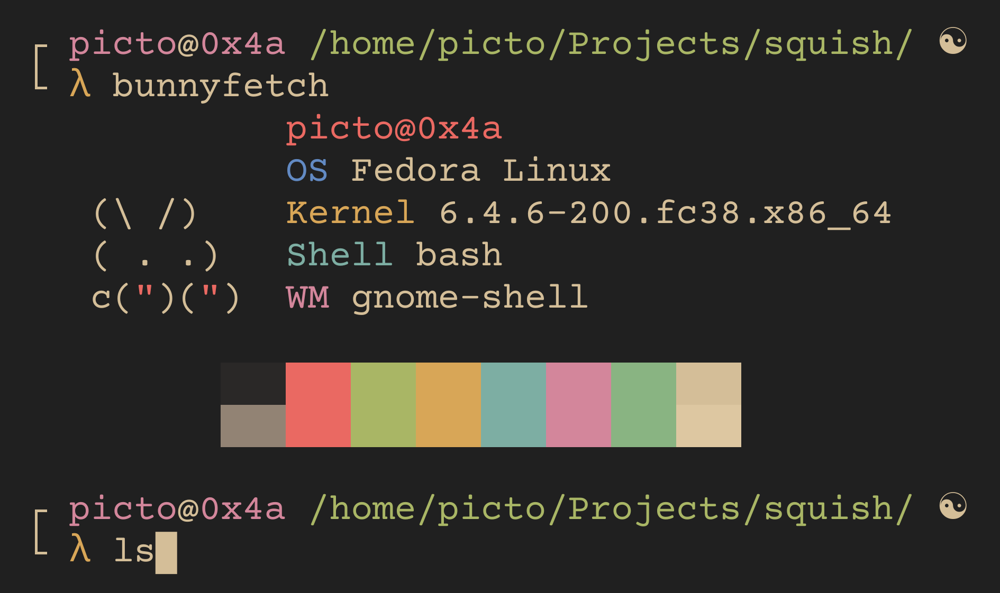

# squish 

squish is a lightweight shell entirely made in Racket which at the moment, is still in beta!
<h3 align="center">
 
<h3>

## Installation

### Script

```bash
git clone https://github.com/mkukiro/squish
cd squish
./install.sh
```

### Manual

```bash
git clone https://github.com/mkukiro/squish
touch ~/.config/squish/config.toml
cd squish
doas install squish /usr/bin
```

Replace `doas` with `sudo` if you don't have it

## Usage
> **Note**
> There is currently no way to `cd` in squish yet

To run squish, make sure you have `rlwrap` installed, and after that, you can run squish anywhere by simply typing running `rlwrap -n squish`
